# Curve logging library

## Description
Curve logging is the process of keeping only the necessary points to give the most accurate representation of the data as possible dictated by a predetermined allowable margin of error. The following two images shows a simple example of curve logging. As an example, let's say we have a device where we were able to log all of the speed points below:

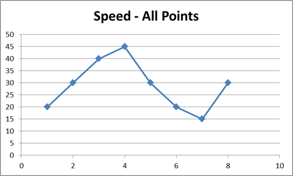

The image below is a sample result of what happens after curve logging algorithm has been applied. Even though the algorithm had removed some of the speed points, the graph below still has the same overall shape as the graph above. Curve logging allows us to reduce the amount of data saved, while allowing us to convey the information that is needed. 

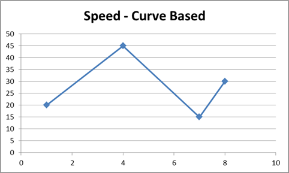


## Algorithm details
Geotab’s curve logging algorithm is based on the [Ramer-Douglas-Peucker](https://en.wikipedia.org/wiki/Ramer%E2%80%93Douglas%E2%80%93Peucker_algorithm) algorithm. This allows for the simplification of a set of data to the least amount of required points to capture the data within an acceptable error value, the *curve error*.

#### Step 0: 
A set of data points

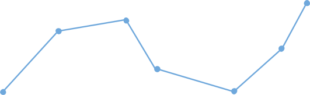

#### Step 1:
Start the curve algorithm by drawing a line from the first point to the last point.

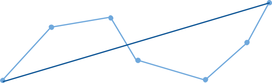

#### Step 2:
Find the point that has the largest perpendicular distance from this new line. If the largest distance is bigger than our allowed *curve error* then we need to keep that point. In this case it is.


#### Step 3:
The largest distance point is kept and a line is drawn from the first point to this retained point and from the retained point to the last point. The curve algorithm is now run again on these two new lines. The point with the largest perpendicular distance from line 1 is bigger than our curve error (red line). The point with the largest perpendicular distance from line 2 is less than our curve error (green line). We keep the point at the end of the red line and discard the point at the end of the green line.

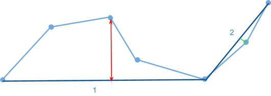

#### Step 4:
Get the largest perpendicular distances from the two new lines, neither of them are larger than our curve error and so can be discarded.

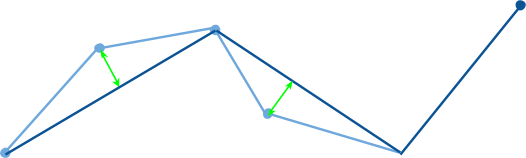

#### Step 5:
The final representation of the data based on the allowed *curve error*.


## Distance measurement methods
In the previous example a distance is calculated between the point which is considered and the line drawn from the first to last point. There are different methods of calculating this distance, and they each have pros and cons. The two methods used in our library are _vertical_ and _perpendicular_ distance. 

### Vertical distance
Vertical distance is a straight line up or down from the point that is considered to the line between the points already saved. The advantage of calculating the distance in this way is that the units of the distance will be the same units as the data which is collected. Making the results are easier to interpret and it can be easy to know what error is introduced by using the curve logic, instead of keeping all the points.

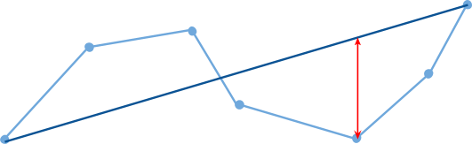

### Perpendicular distance
Another way distance can be to calculate is as a line perpendicular from the point that is considered, to the points already saved. Perpendicular distance is typically used for data which has the same units on both dimensions, such as GPS coordinates. Perpendicular distance can also be used for data which has different units on each dimensions, for example speed data. When measuring the distance in this way, the units of the error will be a combination of the units the data is collected in, as well as the time units. This gives the developer more flexibility over which points are considered important, taking into account the time aspect as well. The disadvantage of using perpendicular error when units are different, is that more testing and tuning of parameters is required.

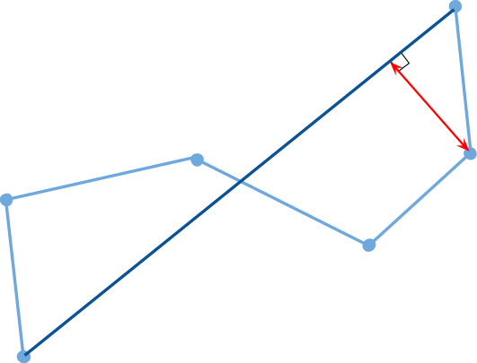

## Library sample usage
Below is a sample of how the library is used, for a full example see [sample.py](sample.py).


Import the library and define some sample data:

```python
import BufferedCurve

# Sample dataset
input_time = [0, 1, 2, 3, 4, 5, 6, 7, 8, 9, 10, 11, 12, 13, 14]
input_data = [1000, 1000, 3000, 6000, 5000, 4000, 4000, 1000, 2000, 3000, 2000, 4000, 5000, 6000, 6001]
```

Define the configurations for the curve and initialize the curve 
```python
BUFFER_SIZE = 7
ALLOWED_ERROR = 15
DATA_RATIO = 100
TIME_RATIO = 100

curve = bufferedCurve.Curve(bufferSize=BUFFER_SIZE, allowedError=ALLOWED_ERROR, dataRatio=DATA_RATIO, timeRatio=TIME_RATIO, errorType=bufferedCurve.Distance.PERPENDICULAR)

```

Add some points to the curve. 
```python

# Iterating over the dataset and adding some points to the curve
for i in range(0,5):
    curve.add_point(input_time[i], input_data[i])
```

Instruct the algorithm to reduce the points added so far.
```python
curve.reduce_current_buffer()
```

Get the simplified points from the curve.
```python
output_data = curve.get_reduced_points()
print (output_data) 
#[[0, 1000], [1, 1000], [3, 6000]]
```

## Speed data reduction
A speed dataset was collected and passed through the curve logic algorithm using the vertical distance calculation. Special logic is implemented around points value of 0, where those points are always saved. The green line indicates the original data, and the blue dots indicate the points which are kept after the algorithm reduced the dataset. The original dataset had 1116 points and was reduced to 148 points, a reduction of over 85%.

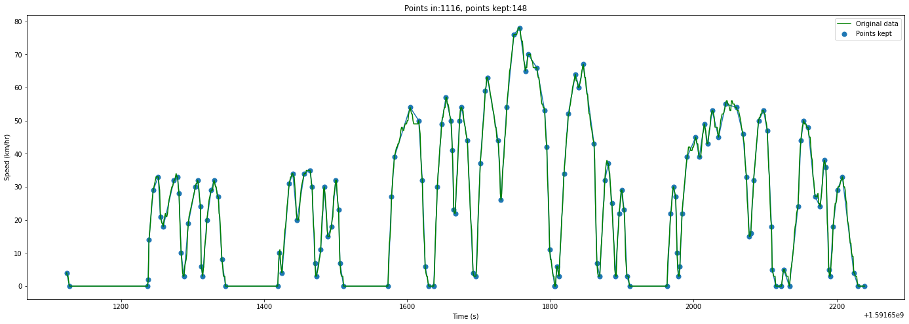

The curve settings allow for 4 km/hr error in the reduction step. Below is a graph showing the error between the points in the original dataset and the interpolated points after the dataset was reduced.

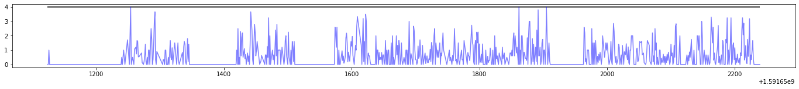


## GPS reduction
The GPS data was recorded for a trip and passed through the curve logic algorithm using the perpendicular distance calculation. The red line is the original dataset, and blue dots indicate the points which are kept after the algorithm ran. The original dataset had 625 points and it was reduced to 23 points, a reduction of over 95%.

<!-- 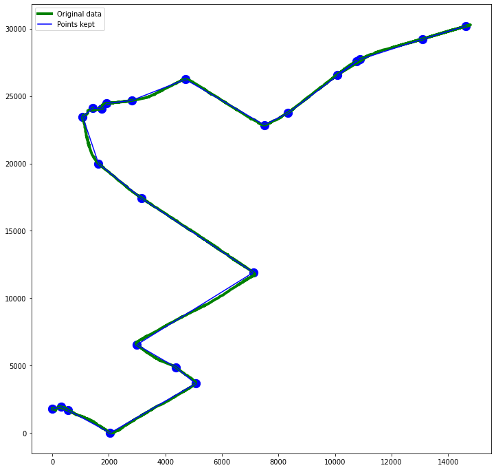 -->
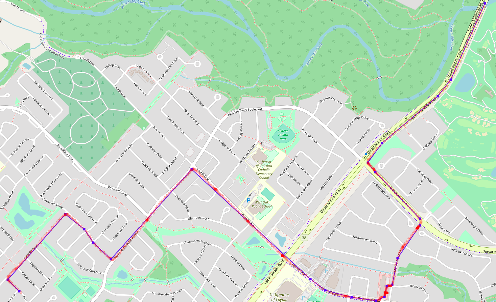


## License and patents
### License
This Source Code Form is subject to the terms of the Mozilla Public
License, v. 2.0. If a copy of the MPL was not distributed with this
file, You can obtain one at https://mozilla.org/MPL/2.0/.

### Patents
A list of the patents protecting the inventions in this code can be found in the following document: https://docs.google.com/document/d/1j6vRAk_BUUK8wpQehtDlVKzGH9HAKtf3Va_c3xVKGec/edit?ts=6013072e